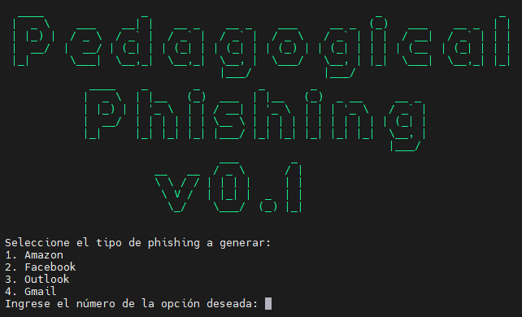
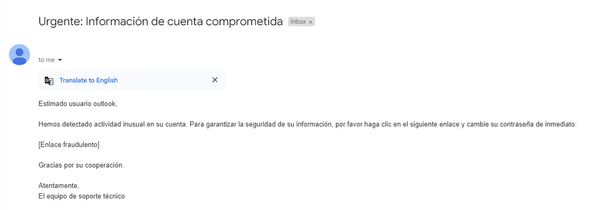

# Creadores
```python
# Información
> Juan Carlos Charfuelan
> Juan David Arias
```



# Pedagogical-Phishing
Este proyecto está diseñado para educar sobre los correos de phishing, proporcionando ejemplos y prácticas para identificar y evitar estos correos maliciosos, esta aplicación esta realizada con el lenguaje de programación Python, utilizando una librería de yagmail, para el envió de correos.

## Tabla de Contenidos
* [Descripción](#Descripción)
* [Instalación](#Instalación)
    * [Crear un ambiente virtual](#Crear)
    * [Activar el ambiente virtual](#Activar)
* [Configuración](#Configuración)
* [Ejecución](#Ejecución)

## Descripción
Pedagogical-Phishing es una herramienta educativa diseñada para enseñar a los usuarios a identificar y evitar correos electrónicos de phishing. El proyecto incluye ejemplos prácticos y ejercicios interactivos que ayudan a los usuarios a reconocer los signos comunes de los correos de phishing. Estos ejercicios pueden enviarse a una lista de correos disponibles, como los de una misma empresa, con el objetivo de auditar y evaluar la respuesta ante intentos de phishing.

## Instalación
### Crear un ambiente virtual
Para aislar el entorno de desarrollo e instalación, es recomendable crear un ambiente virtual. Puedes hacerlo con el siguiente comando:

```bash
python3 -m venv venv
```
### Activar el ambiente virtual

**Para Linux**
```bash
source venv/bin/activate
```

**Para Windows**
```bash
venv\Scripts\activate
```

### Instalación de Requerimientos
Instala los paquetes necesarios especificados en `requirements.txt`:
```bash
pip install -r requirements.txt
```
## Configuración
Antes de ejecutar el `script.sh` se debe de configurar el archivo `.env`, con las variables de entorno para se administradas con Python, estas credenciales son generadas con anterioridad desde el correo remitente, par poder realizar este proceso.
```bash
EMAIL_REMITENTE='gmail-remitente'
EMAIL_CONTRASENA='credencial-aplicacion-para-enviar-correos'
```
También se debe de tener una lista de emails a los cuales se van a enviar los correos de phishing, la lista debe de llamarse `emails.txt`, cada emails debe de ser ingresado con saldo de línea.

## Ejecución
Para ejecutar el codigo debes de dar permiso de ejecucion al los archivos de `script.sh` y `main.py`.

```bash
chmod +x script.sh
chmod +x main.py
```

Ejecución de script de Bash
```bash
./script.h
```

## Ejemplo
El aplicativo envía un correo con el siguiente cuerpo dependiendo de la organización y destinatario a enviar.


